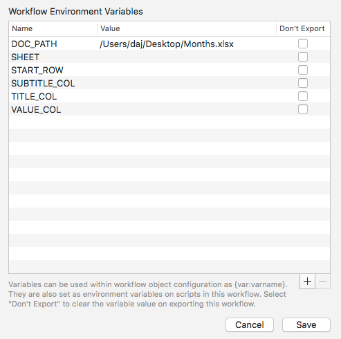

.. I Sheet You Not documentation master file, created by
   sphinx-quickstart on Sat Sep  3 09:58:22 2016.
   You can adapt this file completely to your liking, but it should at least
   contain the root `toctree` directive.

.. _index:

===============
I Sheet You Not
===============

Create auto-updating Alfred 3 workflows from Excel worksheets.

.. image:: _static/demo.gif
    :alt: I Sheet You Not demo

.. _overview:

Overview
========

I Sheet You Not is a workflow generator/template for `Alfred 3`_. It reads
data from an Excel workbook and displays it in Alfred. You can specify
which rows and columns the data are read from, and changes to the data
are picked up automatically by the workflow.

.. _download:

Download and installation
=========================

Download the latest version of the workflow from `GitHub releases`_.
Double-click the downloaded ``I-Sheet-You-Not-X.X.X.alfredworkflow``
file to install in Alfred 3.

.. _usage:

Usage
=====

.. tip::

    Check out the green demo objects in the workflow for examples of how
    to use and configure I Sheet You Not.

Use the keyword ``isyn`` to search for an Excel sheet and generate a new
workflow based on it.

You will be asked to specify a name for your new workflow, which will
then be created and added to Alfred.

The red generator elements are removed from auto-generated workflows.

You should then :ref:`configure the worksheet, first row and data columns in
the workflow configuration sheet <configuration>` (if the defaults are
unsuitable).

Alter one of the green demo objects in the workflow to suit your purpose (e.g.
change the Keyword, Placeholder Title and Subtext) or add your own, then
delete the other, unneeded objects.

.. _configuration:

Configuration
=============

.. note::

    What I Sheet You Not calls the ``VALUE`` is what is typically referred to
    as ``arg`` or ``{query}`` in Alfred workflow terminology. (``arg`` being
    its name in Alfred's JSON and XML format, and ``{query}`` being the text
    macro that Alfred replaces with the value of ``arg``). It is the value
    passed to subsequent workflow elements when you "action" (i.e. hit ↩ on)
    a result shown in Alfred.

By default, the workflow pulls data from the first row of the first worksheet
in the workbook. The item title is pulled from column A, the subtitle from
column B and the value from column C.

To change these, use the ``SHEET``, ``START_ROW``, ``TITLE_COL``,
``SUBTITLE_COL`` and ``VALUE_COL`` options in the workflow configuration
sheet:

``SHEET`` may be the index number of the worksheet or the title.
If ``SHEET`` is unset, it defaults to the first worksheet.

If ``START_ROW`` is unset, it defaults to the first row (i.e. ``1``).

If ``TITLE_COL`` is unset, it defaults to the first column (i.e. ``1``, which
is column A).

If ``SUBTITLE_COL`` is unset, it defaults to the column after ``TITLE_COL``.

If ``VALUE_COL`` is unset, it defaults to the second column after ``TITLE_COL``.

``DATE_FORMAT`` is a `strftime`_ format string that will be used for any
columns that are formatted as dates in the Excel spreadsheet. You can override
this format for specific columns. See :ref:`formatting-values` below.

.. important::

    All rows and columns must be specified as numbers, not letters, so
    set ``TITLE_COL`` to ``1`` for column A, ``2`` for column B etc.

    Only the title is required. If there are no data for subtitle or
    value in the spreadsheet, set ``SUBTITLE_COL`` and/or ``VALUE_COL`` to
    ``0``.

Command-line options
--------------------

Configuration options may also be specified as options to the ``isyn``
command within the Script Filter::

    usage: isyn [-h] [-p FILE] [-m PATTERN] [-n N] [-r N] [-t N] [-s N] [-v N]
            [--version]

    I Sheet You Not. Search Excel data in Alfred 3. Pass this script the path to
    an Excel file via the -p option or the DOC_PATH environment variable. By
    default, the script reads the rows of the first worksheet in the workbook and
    generates Alfred JSON results. It reads the first three columns, treating the
    first as the result title, the second as its subtitle and the third as its
    value (arg).

    optional arguments:
      -h, --help            show this help message and exit
      -p FILE, --docpath FILE
                            Excel file to read data from. Envvar: DOC_PATH
      -m PATTERN, --match PATTERN
                            sprintf-style pattern for Alfred to match against
                            (instead of item title). Envvar: MATCH
      -n N, --sheet N       Number or name of worksheet to read data from. Default
                            is the first sheet in the workbook. Envvar: SHEET
      -r N, --row N         Number of first row to read data from. Default is 1,
                            i.e the first row. Use --row 2 to ignore a title row,
                            for example. Envvar: START_ROW
      -t N, --title N       Number of column to read titles from. Default is the
                            first column. Envvar: TITLE_COL
      -s N, --subtitle N    Number of column to read subtitles from. Default is
                            the column after the title column. Set to 0 if there
                            is no subtitle column. Envvar: SUBTITLE_COL
      -v N, --value N       Number of column to read values from. Default is the
                            second column after the title column. Set to 0 if
                            there is no value column. Envvar: VALUE_COL
      --version             Show workflow version number and exit.

.. _setting-variables:

Extracting data to workflow variables
-------------------------------------

In addition to the title, subtitle and value, you can also extract
additional (or the same) columns to `workflow variables`_, which can be used
by downstream workflow elements. The ``countries`` demo included with the
workflow shows this technique.

To create the workflow variable ``date`` from column 8 (i.e. H), you would
set the workflow/environment variable ``VAR_date=8``.

For example, the following code would extract data from the first worksheet
in the Excel file, using columns A, B and C (1, 2, 3) as title, subtitle
and value respectively (the default behaviour), and in addition set the
workflow variables ``url`` to the data from column D (4) and ``user`` to
column E (5):

.. code-block:: bash
   :linenos:

   # Set workflow variable url from column 4 (D)
   export VAR_url=4
   # Set workflow variable user from column 5 (E)
   export VAR_user=5

   ./isyn

.. _formatting-values:

Formatting values
-----------------

I Sheet You Not attempts to format your data according to the type specified
by its formatting in the Excel worksheet. It is able to recognise text, number
and date types. By default, text and number types are formatted "as-is", while
date types are formatted according to the ``DATE_FORMAT`` specified in the
workflow configuration sheet, which is a `strftime`_ format string.

(Note that Excel exports currency-formatted columns as plain numbers, so you
must specify a format if you'd like to include the currency symbol in ISYN.)

You can specify alternate formats on a per-column basis by setting environment
variables of the form ``FMT_N``, where ``N`` is the number of the column:

.. code-block:: bash
    :linenos:

    # Format column 3 (C) as YYYY-MM-DD date
    export FMT_3='%Y-%m-%d'
    # Add currency symbol to column 5 (E)
    # Use new-style format string to add commas
    export FMT_5='$ {:,.2f}'

For text and number types, the formats are interpreted as `sprintf`_-style
format strings or Python's `str.format`_-style format strings. For dates, the
formats are interpreted as `strftime`_-style format strings.

.. important::

    When using ``$`` in a format string, you **must** surround it in
    single-quotes (as in the above example), otherwise ``bash``/``zsh`` will
    interpret it as a variable, which will fail.

.. _matching:

Matching
--------

Alfred 3.5 introduced the new ``match`` field on items. If specified, Alfred
will filter your results against this field, not the item title.

You can specify the match format using the ``--match`` flag to the ``isyn``
command or via the ``MATCH`` workflow variable. The ``match`` field uses
`sprintf`_-style format strings and *named variables*. That is to say, you
can only use variables you've extracted from your Excel sheet with ``VAR_xyz``
patterns:

.. code-block:: bash
    :linenos:

    # Extract a couple of variables
    export VAR_name=1
    export VAR_year=3
    # Set the match field to include both
    export MATCH='%(name)s %(year)s'
    # Use first column (A) for item title and second (B) for subtitle
    export TITLE_COL=1
    export SUBTITLE_COL=2

The above configuration will allow you to filter items by year as well as
title.

.. _feedback:

Feedback, questions, bugs, feature requests
===========================================

If you have feedback or questions regarding I Sheet You Not, please post
them in the `Alfred forum thread`_.

If you have a bug report or feature request, please create a new
`GitHub issue`_.

.. _licensing-and-thanks:

Licensing and thanks
====================

I Sheet You Not is released under the MIT License. It is based on the
`xlrd library for Python`_, released under a `BSD-style licence`_.

The workflow icon was created by carlosjj from `IconArchive.com`_.

.. toctree::
    :maxdepth: 2

    licence

.. _changelog-index:

Changelog
=========

.. toctree::
    :maxdepth: 2

    changelog

.. _api-index:

Auto-generated API docs
=======================

This documentation was auto-generated by sphinx from the source code.

.. toctree::
   :maxdepth: 2

   api

.. _indices:

Indices and tables
==================

* :ref:`genindex`
* :ref:`modindex`
* :ref:`search`

.. _Alfred 3: https://www.alfredapp.com/
.. _xlrd library for Python: http://www.python-excel.org
.. _BSD-style licence: https://github.com/python-excel/xlrd/blob/master/docs/licenses.rst
.. _IconArchive.com: http://www.iconarchive.com/show/google-jfk-icons-by-carlosjj/spreadsheets-icon.html
.. _GitHub issue: https://github.com/deanishe/i-sheet-you-not/issues
.. _GitHub releases: https://github.com/deanishe/i-sheet-you-not/releases
.. _Alfred forum thread: http://www.alfredforum.com/topic/9469-i-sheet-you-not-plug-excel-into-alfred/
.. _workflow variables: https://www.alfredapp.com/help/workflows/advanced/variables/
.. _strftime: http://strftime.org
.. _sprintf: https://docs.python.org/2/library/stdtypes.html#string-formatting
.. _str.format: https://docs.python.org/2.7/library/string.html#formatstrings
